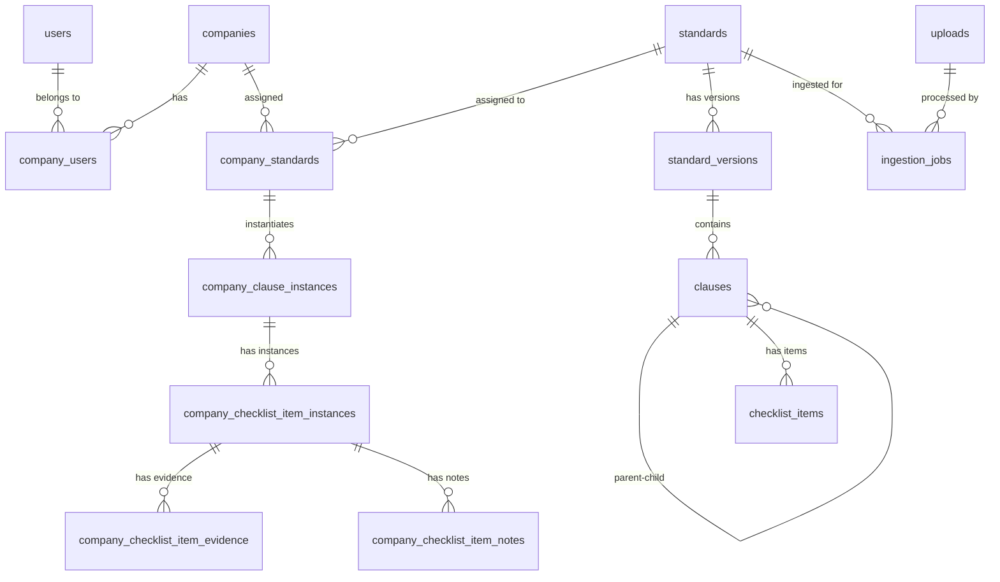

# Database Schema Documentation

This document describes the complete database schema for the Way to Excellence platform.

## Overview

The database is designed to support:

- Multi-tenant architecture with company-based isolation
- Internationalization (i18n) support for multiple languages
- Hierarchical standards with versioning
- Compliance tracking and evidence management
- Audit logging and user management

## Schema Diagram

## Core Enums

### LanguageDirection

- `ltr` - Left-to-right text direction
- `rtl` - Right-to-left text direction

### UserRole

- `super_admin` - Platform-level admin
- `company_admin` - Manages a company
- `auditor` - Runs internal audits
- `contributor` - Fills evidence/notes
- `viewer` - Read-only access

### IngestionStatus

- `queued` - Waiting to be processed
- `processing` - Currently being processed
- `succeeded` - Successfully completed
- `failed` - Processing failed

### AssignmentStatus

- `active` - Currently active
- `inactive` - Temporarily disabled
- `archived` - Permanently disabled

### ChecklistItemType

- `requirement` - Mandatory requirement
- `question` - Audit question
- `control` - Control measure
- `note` - Informational note

### ComplianceStatus

- `not_started` - Not yet begun
- `in_progress` - Currently working on
- `compliant` - Fully compliant
- `partially_compliant` - Partially compliant
- `not_compliant` - Not compliant
- `not_applicable` - Not applicable

### EvidenceType

- `file` - File upload
- `url` - External URL
- `text` - Text description

## Tables

### Identity & Tenancy

#### users

Core user accounts for the platform.

| Column      | Type         | Constraints      | Description                           |
| ----------- | ------------ | ---------------- | ------------------------------------- |
| id          | uuid         | PK               | Unique identifier                     |
| email       | varchar(320) | NOT NULL, UNIQUE | User email address                    |
| name        | varchar(200) |                  | Display name                          |
| is_active   | bool         | DEFAULT true     | Account status                        |
| locale_code | varchar(10)  |                  | Preferred language (e.g., 'en', 'ar') |
| created_at  | timestamptz  | DEFAULT now()    | Creation timestamp                    |
| updated_at  | timestamptz  | DEFAULT now()    | Last update timestamp                 |

#### companies

Multi-tenant company entities.

| Column         | Type         | Constraints         | Description                |
| -------------- | ------------ | ------------------- | -------------------------- |
| id             | uuid         | PK                  | Unique identifier          |
| name           | varchar(200) | NOT NULL, UNIQUE    | Company name               |
| license_seats  | int          | NOT NULL, DEFAULT 1 | Maximum user seats         |
| is_active      | bool         | DEFAULT true        | Company status             |
| default_locale | varchar(10)  |                     | Preferred display language |
| created_at     | timestamptz  | DEFAULT now()       | Creation timestamp         |
| updated_at     | timestamptz  | DEFAULT now()       | Last update timestamp      |

#### company_users

Junction table linking users to companies with roles.

| Column     | Type        | Constraints                 | Description          |
| ---------- | ----------- | --------------------------- | -------------------- |
| id         | uuid        | PK                          | Unique identifier    |
| company_id | uuid        | NOT NULL, FK → companies.id | Company reference    |
| user_id    | uuid        | NOT NULL, FK → users.id     | User reference       |
| role       | UserRole    | NOT NULL, DEFAULT 'viewer'  | User role in company |
| is_active  | bool        | DEFAULT true                | Assignment status    |
| created_at | timestamptz | DEFAULT now()               | Assignment timestamp |

**Indexes:**

- `(company_id, user_id)` - UNIQUE

### Internationalization

#### languages

Supported languages for content translation.

| Column    | Type              | Constraints             | Description                      |
| --------- | ----------------- | ----------------------- | -------------------------------- |
| code      | varchar(10)       | PK                      | Language code (e.g., 'en', 'ar') |
| name      | varchar(100)      | NOT NULL                | Language display name            |
| direction | LanguageDirection | NOT NULL, DEFAULT 'ltr' | Text direction                   |

### Standards Management

#### standards

Core standard definitions (e.g., ISO 9001, KAQA 2024).

| Column     | Type         | Constraints      | Description                     |
| ---------- | ------------ | ---------------- | ------------------------------- |
| id         | uuid         | PK               | Unique identifier               |
| code       | varchar(100) | NOT NULL, UNIQUE | Standard code (e.g., 'ISO9001') |
| is_primary | bool         | DEFAULT false    | Primary standard flag           |
| created_by | uuid         | FK → users.id    | Creator reference               |
| created_at | timestamptz  | DEFAULT now()    | Creation timestamp              |
| updated_at | timestamptz  | DEFAULT now()    | Last update timestamp           |

#### standard_translations

Translated names and descriptions for standards.

| Column        | Type         | Constraints                   | Description              |
| ------------- | ------------ | ----------------------------- | ------------------------ |
| id            | uuid         | PK                            | Unique identifier        |
| standard_id   | uuid         | NOT NULL, FK → standards.id   | Standard reference       |
| language_code | varchar(10)  | NOT NULL, FK → languages.code | Language reference       |
| name          | varchar(255) | NOT NULL                      | Translated standard name |
| description   | text         |                               | Translated description   |

**Indexes:**

- `(standard_id, language_code)` - UNIQUE

#### standard_versions

Versioned instances of standards with source PDFs.

| Column        | Type         | Constraints                   | Description                               |
| ------------- | ------------ | ----------------------------- | ----------------------------------------- |
| id            | uuid         | PK                            | Unique identifier                         |
| standard_id   | uuid         | NOT NULL, FK → standards.id   | Standard reference                        |
| version_label | varchar(100) | NOT NULL                      | Version identifier (e.g., '2015', 'v1.2') |
| source_pdf_id | uuid         | FK → uploads.id               | Source PDF reference                      |
| status        | varchar(30)  | NOT NULL, DEFAULT 'published' | Version status                            |
| created_by    | uuid         | FK → users.id                 | Creator reference                         |
| created_at    | timestamptz  | DEFAULT now()                 | Creation timestamp                        |
| published_at  | timestamptz  |                               | Publication timestamp                     |
| notes         | text         |                               | Version notes                             |

**Indexes:**

- `(standard_id, version_label)` - UNIQUE

#### ingestion_jobs

Background job tracking for PDF processing.

| Column       | Type            | Constraints                 | Description                |
| ------------ | --------------- | --------------------------- | -------------------------- |
| id           | uuid            | PK                          | Unique identifier          |
| standard_id  | uuid            | NOT NULL, FK → standards.id | Standard reference         |
| input_pdf_id | uuid            | NOT NULL, FK → uploads.id   | PDF reference              |
| status       | IngestionStatus | NOT NULL, DEFAULT 'queued'  | Job status                 |
| started_at   | timestamptz     |                             | Processing start time      |
| finished_at  | timestamptz     |                             | Processing completion time |
| message      | text            |                             | Status/error message       |
| created_by   | uuid            | FK → users.id               | Creator reference          |
| created_at   | timestamptz     | DEFAULT now()               | Creation timestamp         |

#### uploads

File storage metadata.

| Column       | Type         | Constraints   | Description        |
| ------------ | ------------ | ------------- | ------------------ |
| id           | uuid         | PK            | Unique identifier  |
| storage_path | varchar(500) | NOT NULL      | Blob path/S3 key   |
| filename     | varchar(255) | NOT NULL      | Original filename  |
| mime_type    | varchar(100) |               | File MIME type     |
| size_bytes   | bigint       |               | File size in bytes |
| uploaded_by  | uuid         | FK → users.id | Uploader reference |
| created_at   | timestamptz  | DEFAULT now() | Upload timestamp   |

### Hierarchical Structure

#### clauses

Hierarchical clause structure within standard versions.

| Column              | Type         | Constraints                         | Description                             |
| ------------------- | ------------ | ----------------------------------- | --------------------------------------- |
| id                  | uuid         | PK                                  | Unique identifier                       |
| standard_version_id | uuid         | NOT NULL, FK → standard_versions.id | Version reference                       |
| parent_id           | uuid         | FK → clauses.id                     | Parent clause (null for root)           |
| code                | varchar(100) | NOT NULL                            | Clause code (e.g., "4", "4.1", "8.5.1") |
| sort_order          | int          | NOT NULL, DEFAULT 0                 | Display order                           |
| stable_key          | varchar(200) |                                     | Persistent logical key for versioning   |

**Indexes:**

- `(standard_version_id, code)` - UNIQUE
- `(standard_version_id, parent_id, sort_order)`
- `(stable_key)`

#### clause_translations

Translated clause content.

| Column        | Type         | Constraints                   | Description        |
| ------------- | ------------ | ----------------------------- | ------------------ |
| id            | uuid         | PK                            | Unique identifier  |
| clause_id     | uuid         | NOT NULL, FK → clauses.id     | Clause reference   |
| language_code | varchar(10)  | NOT NULL, FK → languages.code | Language reference |
| title         | varchar(500) | NOT NULL                      | Clause title       |
| summary       | text         |                               | Clause summary     |
| body          | text         |                               | Full clause text   |

**Indexes:**

- `(clause_id, language_code)` - UNIQUE

#### checklist_items

Checklist items under clauses.

| Column     | Type              | Constraints                     | Description                 |
| ---------- | ----------------- | ------------------------------- | --------------------------- |
| id         | uuid              | PK                              | Unique identifier           |
| clause_id  | uuid              | NOT NULL, FK → clauses.id       | Clause reference            |
| item_type  | ChecklistItemType | NOT NULL, DEFAULT 'requirement' | Item type                   |
| code       | varchar(100)      |                                 | Sub-index (e.g., "8.5.1-a") |
| sort_order | int               | NOT NULL, DEFAULT 0             | Display order               |
| stable_key | varchar(200)      |                                 | Persistent logical key      |

**Indexes:**

- `(clause_id, sort_order)`
- `(clause_id, code)`
- `(stable_key)`

#### checklist_item_translations

Translated checklist item content.

| Column            | Type        | Constraints                       | Description                   |
| ----------------- | ----------- | --------------------------------- | ----------------------------- |
| id                | uuid        | PK                                | Unique identifier             |
| checklist_item_id | uuid        | NOT NULL, FK → checklist_items.id | Item reference                |
| language_code     | varchar(10) | NOT NULL, FK → languages.code     | Language reference            |
| text              | text        | NOT NULL                          | Item text                     |
| guidance          | text        |                                   | Auditor guidance and examples |

**Indexes:**

- `(checklist_item_id, language_code)` - UNIQUE

### Company Assignments

#### company_standards

Assignment of standards to companies with version pinning.

| Column            | Type             | Constraints                         | Description          |
| ----------------- | ---------------- | ----------------------------------- | -------------------- |
| id                | uuid             | PK                                  | Unique identifier    |
| company_id        | uuid             | NOT NULL, FK → companies.id         | Company reference    |
| standard_id       | uuid             | NOT NULL, FK → standards.id         | Standard reference   |
| status            | AssignmentStatus | NOT NULL, DEFAULT 'active'          | Assignment status    |
| active_version_id | uuid             | NOT NULL, FK → standard_versions.id | Current version      |
| assigned_by       | uuid             | FK → users.id                       | Assigner reference   |
| assigned_at       | timestamptz      | DEFAULT now()                       | Assignment timestamp |
| notes             | text             |                                     | Assignment notes     |

**Indexes:**

- `(company_id, standard_id)` - UNIQUE

#### company_standard_version_history

Historical tracking of version changes.

| Column              | Type        | Constraints                         | Description          |
| ------------------- | ----------- | ----------------------------------- | -------------------- |
| id                  | uuid        | PK                                  | Unique identifier    |
| company_standard_id | uuid        | NOT NULL, FK → company_standards.id | Assignment reference |
| from_version_id     | uuid        | FK → standard_versions.id           | Previous version     |
| to_version_id       | uuid        | NOT NULL, FK → standard_versions.id | New version          |
| changed_by          | uuid        | FK → users.id                       | Changer reference    |
| changed_at          | timestamptz | DEFAULT now()                       | Change timestamp     |
| reason              | text        |                                     | Change reason        |

### Company Instances

#### company_clause_instances

Company-specific instances of clauses.

| Column              | Type         | Constraints                         | Description              |
| ------------------- | ------------ | ----------------------------------- | ------------------------ |
| id                  | uuid         | PK                                  | Unique identifier        |
| company_standard_id | uuid         | NOT NULL, FK → company_standards.id | Assignment reference     |
| clause_id           | uuid         | NOT NULL, FK → clauses.id           | Template clause          |
| clause_code         | varchar(100) |                                     | Denormalized clause code |
| version_id          | uuid         | NOT NULL, FK → standard_versions.id | Version reference        |

**Indexes:**

- `(company_standard_id, clause_id)` - UNIQUE
- `(company_standard_id, version_id)`

#### company_checklist_item_instances

Company-specific instances of checklist items.

| Column                     | Type             | Constraints                                | Description               |
| -------------------------- | ---------------- | ------------------------------------------ | ------------------------- |
| id                         | uuid             | PK                                         | Unique identifier         |
| company_clause_instance_id | uuid             | NOT NULL, FK → company_clause_instances.id | Clause instance reference |
| checklist_item_id          | uuid             | NOT NULL, FK → checklist_items.id          | Template item             |
| status                     | ComplianceStatus | NOT NULL, DEFAULT 'not_started'            | Compliance status         |
| assigned_to                | uuid             | FK → users.id                              | Assignee reference        |
| due_date                   | date             |                                            | Due date                  |
| last_updated_by            | uuid             | FK → users.id                              | Last updater reference    |
| last_updated_at            | timestamptz      | DEFAULT now()                              | Last update timestamp     |

**Indexes:**

- `(company_clause_instance_id, checklist_item_id)` - UNIQUE
- `(status)`
- `(assigned_to)`

#### company_checklist_item_notes

Notes on checklist item instances.

| Column                     | Type        | Constraints                                        | Description        |
| -------------------------- | ----------- | -------------------------------------------------- | ------------------ |
| id                         | uuid        | PK                                                 | Unique identifier  |
| checklist_item_instance_id | uuid        | NOT NULL, FK → company_checklist_item_instances.id | Instance reference |
| author_id                  | uuid        | FK → users.id                                      | Author reference   |
| note                       | text        | NOT NULL                                           | Note content       |
| created_at                 | timestamptz | DEFAULT now()                                      | Creation timestamp |

#### company_checklist_item_evidence

Evidence attached to checklist item instances.

| Column                     | Type         | Constraints                                        | Description        |
| -------------------------- | ------------ | -------------------------------------------------- | ------------------ |
| id                         | uuid         | PK                                                 | Unique identifier  |
| checklist_item_instance_id | uuid         | NOT NULL, FK → company_checklist_item_instances.id | Instance reference |
| evidence_type              | EvidenceType | NOT NULL                                           | Evidence type      |
| evidence_text              | text         |                                                    | Text/URL content   |
| file_upload_id             | uuid         | FK → uploads.id                                    | File reference     |
| added_by                   | uuid         | FK → users.id                                      | Adder reference    |
| added_at                   | timestamptz  | DEFAULT now()                                      | Addition timestamp |

### Audit & Logging

#### audit_logs

Comprehensive audit trail for all platform activities.

| Column        | Type         | Constraints       | Description          |
| ------------- | ------------ | ----------------- | -------------------- |
| id            | uuid         | PK                | Unique identifier    |
| actor_user_id | uuid         | FK → users.id     | Actor reference      |
| company_id    | uuid         | FK → companies.id | Company reference    |
| action        | varchar(200) | NOT NULL          | Action performed     |
| entity_type   | varchar(100) |                   | Entity type affected |
| entity_id     | uuid         |                   | Entity ID affected   |
| payload_json  | jsonb        |                   | Additional data      |
| created_at    | timestamptz  | DEFAULT now()     | Action timestamp     |

## Key Design Principles

1. **Multi-tenancy**: Company-based isolation with proper access controls
2. **Internationalization**: Full i18n support with language-specific content
3. **Versioning**: Standards can have multiple versions with proper tracking
4. **Hierarchical Structure**: Flexible clause and checklist item hierarchies
5. **Audit Trail**: Comprehensive logging of all platform activities
6. **Performance**: Strategic indexing for common query patterns
7. **Flexibility**: Support for various compliance frameworks and standards

## Migration Strategy

When implementing this schema:

1. Create core tables (users, companies, languages)
2. Add standards management tables
3. Implement hierarchical structure tables
4. Add company assignment and instance tables
5. Create audit logging infrastructure
6. Add appropriate indexes and constraints
7. Populate with initial data (languages, default standards)

## Notes

- All timestamps use `timestamptz` for proper timezone handling
- UUIDs are used for all primary keys for better distributed system support
- The schema supports both RTL and LTR languages
- Stable keys enable proper versioning and diffing of standards
- Denormalized fields improve query performance where appropriate
