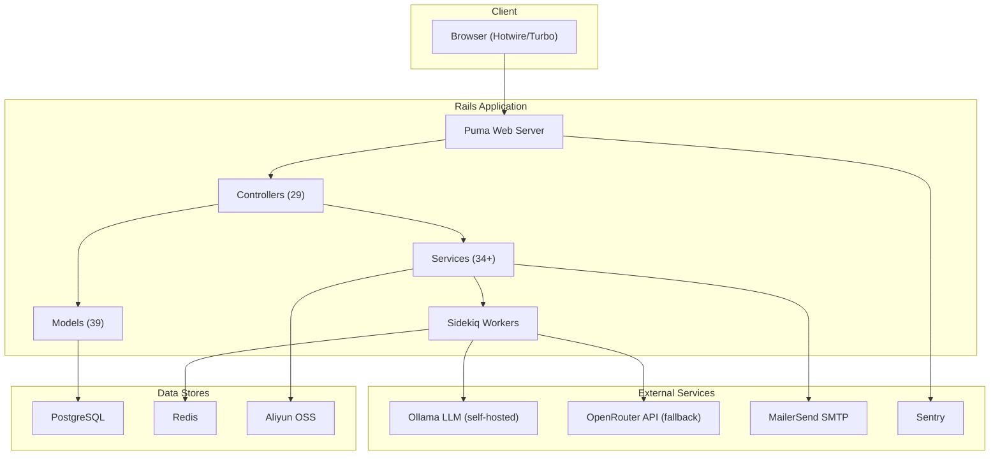
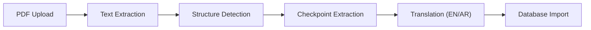
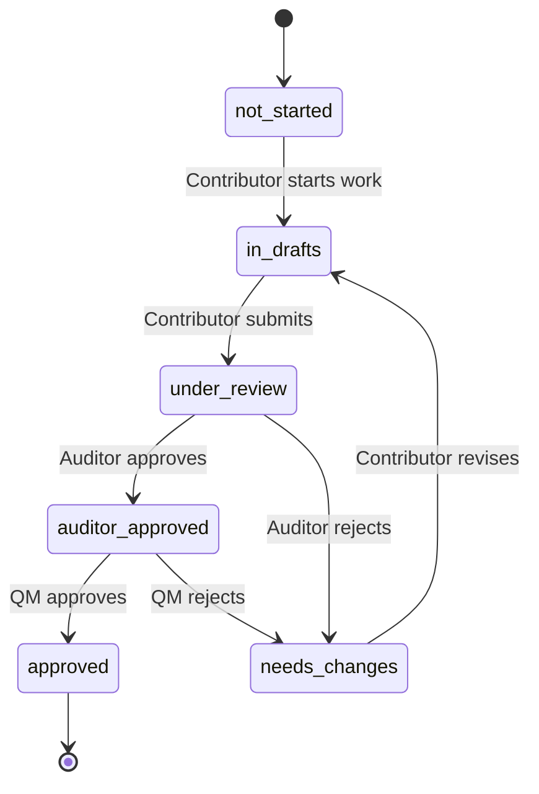
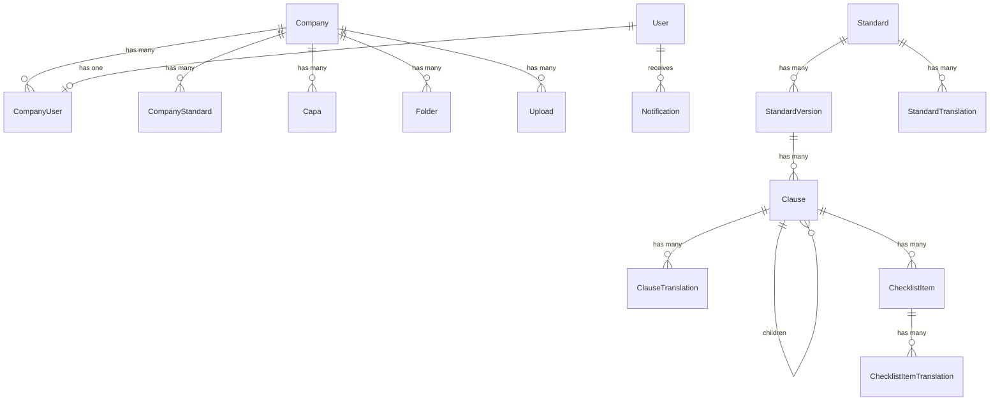
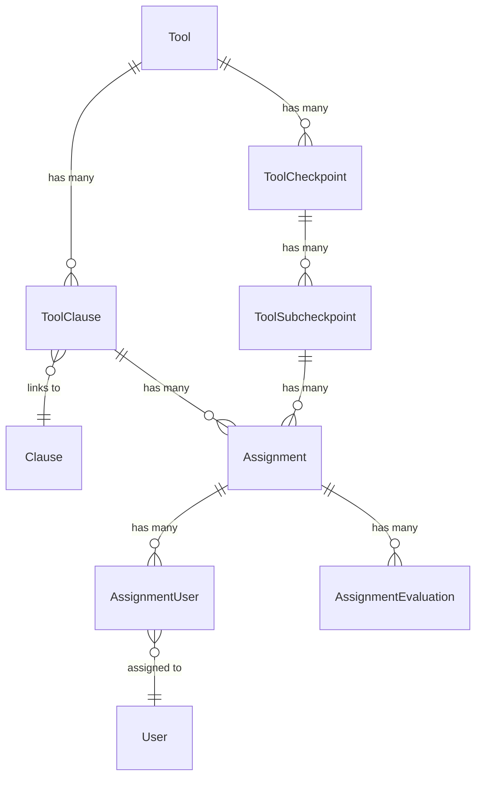
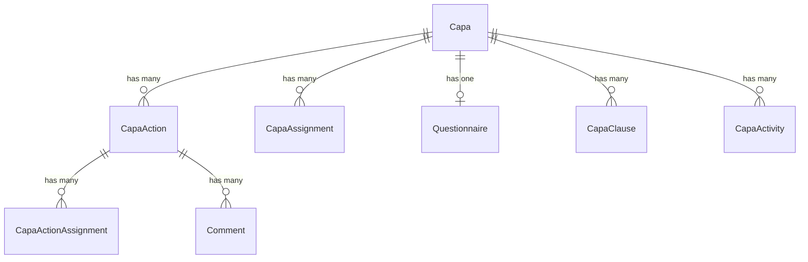
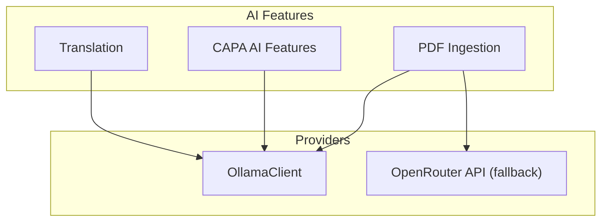

# Way to Excellence — Project Documentation

---

## Table of Contents

- [1. High-Level Summary](#1-high-level-summary)
- [2. Functional Walkthrough](#2-functional-walkthrough)
- [3. Technical Documentation](#3-technical-documentation)

---

## 1. High-Level Summary

### 1.1 What It Is

- **Way to Excellence** is a quality management and compliance platform for organizations adopting standards such as ISO 9001, EFQM, and Qiyas
- Digitizes the full compliance lifecycle: standard ingestion from PDF, clause breakdown, team assignment, evaluation, scoring, and CAPA (Corrective and Preventive Action) management
- Multi-tenant architecture — each company operates in an isolated data scope
- Bilingual: full English and Arabic support with RTL layout

### 1.2 Problem It Solves

- Replaces manual, spreadsheet-driven compliance tracking that is error-prone, untraceable, and unscalable
- Provides structured digital workflows for auditing, scoring, evidence linking, and root cause analysis
- AI-assisted document processing eliminates manual extraction of clauses and checkpoints from standards PDFs

### 1.3 Tech Stack

| Layer | Technology |
|---|---|
| **Language** | Ruby 3.x |
| **Framework** | Rails 8.0.2 |
| **Database** | PostgreSQL (with `pg_trgm`, `pgcrypto` extensions) |
| **Background Jobs** | Sidekiq 8.0 + Redis |
| **Frontend** | Hotwire (Turbo + Stimulus), Tailwind CSS 4.1 |
| **AI / LLM** | Ollama (self-hosted Qwen models) + OpenRouter (Claude Sonnet fallback) |
| **File Storage** | Aliyun Object Storage (Active Storage) |
| **Email** | MailerSend SMTP (`smtp.mailersend.net:587`) |
| **Search** | pg_search 2.3 (tsearch + trigram) |
| **Auth** | Devise |
| **Pagination** | Pagy 8.0 (7 items/page) |
| **Charts** | Chartkick |
| **PDF Processing** | Apache Tika (primary), pdf-reader, Tesseract OCR (legacy fallback) |
| **Excel Parsing** | Roo 2.10 (Qiyas structured uploads) |
| **Error Tracking** | Sentry |
| **Deployment** | Kamal (Docker-based) |

### 1.4 Current State

- **39 models**, **29 controllers**, **34+ services**, **5 background jobs**, **4 mailers**
- **31 database tables** (excluding Active Storage and pg_search internals)
- UUIDs as primary keys across all domain tables
- Pre-launch waitlist flow active alongside full platform
- Production deployment via Kamal with Aliyun OSS for file storage
- Time zone: Asia/Riyadh

### 1.5 Architecture Overview



---

## 2. Functional Walkthrough

### 2.1 User Roles

| Role | Scope | Capabilities |
|---|---|---|
| **Super Admin** | Platform-wide | Full access: manage companies, users, standards, tools, credits, analytics |
| **Delegated Admin** | Platform-wide (subset) | Granular permissions: manage companies, users, credits, standards (configurable) |
| **Company Admin** | Single company | Manage company users, assign standards, manage CAPAs, assign tools |
| **Quality Manager** | Single company | Review auditor-approved assignments, give final approval |
| **Auditor** | Single company | Evaluate and score assigned clause/subcheckpoint work |
| **Contributor** | Single company | Work on assigned tasks: add content, link evidence |
| **Viewer** | Single company | Read-only access to all company data |

#### Permission Flags (Delegated Admin)

- `add_companies`, `update_company_profiles`, `add_users`, `increase_credit`, `remove_companies`, `assign_standards_to_companies`, `activate_deactivate_users`, `modify_license_seats`, `manage_tools`

### 2.2 Onboarding and Authentication

#### Pre-Launch Waitlist (self-signup)
- **Where:** `/waitlist`
- **How:**
  1. User submits public form: company name, company size, their name, email, desired role
  2. System creates provisional `Company` and `User` records with `status: pending` (inactive)
  3. Sends bilingual welcome email (EN/AR based on locale)
  4. Redirects to `/waitlist/success`
  5. **Super Admin must manually activate the user and set their password** before the user can log in

#### User Invitation (admin-initiated)
- **Where:** `/invitations/:token/accept`
- **How:**
  1. Super Admin creates invitation from Account Management
  2. System generates invitation token and sends email with acceptance link
  3. User clicks link, sets their own password, and accepts the invitation
  4. Account is activated immediately upon acceptance
- Token has expiration date; validated on access
- Supports company-scoped invitations and delegated admin invitations

#### Login / Logout
- **Where:** `/users/sign_in`
- **How:** Devise-based email + password authentication
- Successful login creates audit log entry
- Inactive users blocked from authentication with custom message
- After sign-in: redirects to `/dashboard`

### 2.3 Dashboard and Overview

#### Super Admin Overview
- **Where:** `/dashboard/overview`
- **What it shows:**
  - Total standards, companies, users, CAPAs
  - Average compliance percentage across all companies
  - CAPA status distribution (open, assigned, in-progress, closed)
  - Credit usage over time
  - Evaluation statistics
- **Filters:** Date range picker

#### Quality Manager Dashboard
- **Where:** `/dashboard/quality_manager`
- **What it shows:**
  - Pending auditor-approved assignments awaiting final QM approval
  - Recently approved assignments with statistics

### 2.4 Standards Management

#### Standard Upload and Ingestion
- **Where:** `/standards` → "Upload Standard"
- **How:**
  1. Admin uploads PDF (or XLSX for Qiyas)
  2. System creates `IngestionJob` and queues `ProcessIngestionJob`
  3. Pipeline extracts text via Apache Tika, detects structure, extracts checkpoints, translates EN↔AR
  4. Creates hierarchical `Clause` and `ChecklistItem` records with bilingual translations
- **Pipeline types:** `efqm`, `iso9001`, `qiyas`, `generic`
- **EFQM optimization:** Copies clause structure from existing versions to avoid reprocessing



#### Standard Viewer and Editor
- **Where:** `/standards/:id`
- **What you can do:**
  - Browse hierarchical clause tree (parent → children → checklist items)
  - Create, edit, move, reorder, and delete clauses
  - Create, edit, move, and delete checklist items (requirements, questions, controls, notes)
  - Edit bilingual translations inline
  - Mark translations as reviewed / needing review
  - Set point allocation per clause; auto-distributes to children

#### Version Management
- **Where:** `/standards/:id/new_version`
- **What you can do:**
  - Create new version from scratch or by re-uploading PDF
  - Publish draft versions
  - Compare two versions side-by-side (`/standards/:id/compare/:compare_with`)
  - Track version history per company

#### Assign Standards to Companies
- **Where:** `/standards/:id` → Assign button
- **How:** Select a version and target company → creates `CompanyStandard` + `CompanyClauseInstance` records

### 2.5 Tools (Evaluation Instruments)

#### Tool CRUD
- **Where:** `/tools`
- **What:** Create evaluation frameworks with named checkpoints and subcheckpoints
- **Checkpoints:** Named groupings (e.g., "Leadership Assessment")
- **Subcheckpoints:** Individual evaluation criteria with scoring type:
  - `Number` — numeric range (min/max)
  - `Percentage` — 0-100%
  - `Multiple Choice` — JSON array of options
- **Business rules:** JSON-based rules engine (e.g., `average_cannot_exceed_attribute`)

#### Link Tool to Standard
- **Where:** `/tools/:id` → Link Standard
- **How:** Select a standard → links tool's subcheckpoints to standard's terminal clauses
- Each clause can only be linked to one tool at a time

#### Assign Users to Subcheckpoints
- **Where:** `/tools/:id` → Assignment matrix
- **How:**
  - Select company → select clause → select subcheckpoint → assign users
  - Creates `ToolClauseSubcheckpointAssignment` (container) + `ToolClauseSubcheckpointAssignmentsUser` (per user)
  - Supports bulk assignment / unassignment
  - Triggers notifications to assigned users

### 2.6 Assignments and Evaluation Workflow

#### Assignment View (Contributor)
- **Where:** `/assignments/:id`
- **What contributors see:**
  - Clause details, subcheckpoint criteria, scoring info
  - Text editor for summary content
  - Document linking for evidence
- **Status:** Not Started → In Drafts → Under Review

#### Evaluation (Auditor / Quality Manager)
- **Where:** `/assignments/:id` → Evaluate
- **How:**
  - Auditor scores and approves/rejects → status becomes `auditor_approved` or `needs_changes`
  - Quality Manager gives final approval → status becomes `approved` or `needs_changes`
  - Each evaluation creates `AssignmentEvaluation` record with score + feedback
- **Score propagation:** On approval, scores propagate up the clause hierarchy via `ClauseScorePropagator`
- **Business rule validation:** `BusinessRuleValidator` checks tool rules before acceptance



### 2.7 CAPA Management

#### Create CAPA
- **Where:** `/dashboard/capa_management`
- **Fields:** Title, description, source, priority (low/medium/high), linked standard, due date
- Generates `CAPA-{friendly_id}-{date}` code
- Requires company selection for company-scoped users

#### CAPA Views
- **List view:** `/dashboard/capa_management/list` — filterable table
- **Board view:** `/dashboard/capa_management/board` — Kanban-style by status
- **Archives:** `/dashboard/capa_management/archives` — archived CAPAs

#### CAPA Detail
- **Where:** `/dashboard/capa_management/:id`
- **What you can do:**
  - Edit title, description, source, priority, due date, analysis method
  - Assign/unassign team members
  - Link/unlink standard clauses
  - Link/unlink evidence documents
  - View activity timeline
  - Change status: open → assigned → in_progress → closed

#### CAPA Actions
- **Where:** `/dashboard/capa_management/:capa_id/capa_actions/:id`
- **What:** Individual corrective or preventive actions within a CAPA
- **Fields:** Title, type (corrective/preventive), status (started/in_progress/done), due date, notes
- **Features:** Assign users, link evidence, add comments with threaded replies

#### AI Features (CAPA)
- **Questionnaire generation:** 5-question structured questionnaire → root cause analysis (free)
- **Action generation:** AI suggests corrective/preventive actions (5 credits)
- **Clause suggestion:** AI recommends relevant standard clauses for the CAPA (7 credits)
- **Root cause regeneration:** Regenerate root cause from updated answers (free)

#### Export
- **Where:** `/dashboard/capa_management/export`
- **Format:** ZIP containing two CSV files (CAPAs + Actions)
- **Bilingual:** Column headers in selected language (EN or AR)

#### Bulk Operations
- Bulk archive / unarchive / delete CAPAs

### 2.8 Document Library

#### Folder Management
- **Where:** `/library`
- **What you can do:**
  - Create nested folders with color coding (hex colors)
  - Move folders (parent reassignment)
  - Delete folders (cascades to children and files)
  - View file count per folder (including subfolders)

#### File Upload and Management
- **Where:** `/uploads/new` or within folder view
- **What you can do:**
  - Upload files with metadata (name, notes)
  - Set visibility: `public` (all company users) or `private` (uploader + admins only)
  - Move files between folders
  - Download files
  - View linked items (which CAPAs, clauses, etc. reference this file)

#### Evidence Linking
- **How:** From any entity (standard, clause, checklist item, CAPA, CAPA action, assignment) → attach existing upload as evidence
- Creates `EvidenceAttachment` polymorphic record
- Triggers notification to relevant auditors

### 2.9 AI Features and Credits

#### Credit System
- **Company pool:** Each company has a credit balance (default: 1000)
- **User allocation:** Company credits distributed to individual users
- **Distribution methods:**
  - Manual per-user assignment
  - Split equally across all users
  - Reset all to zero

#### Credit Costs

| Action | Credits |
|---|---|
| Generate CAPA questionnaire | 0 (free) |
| Regenerate root cause | 0 (free) |
| Generate CAPA actions | 5 |
| Suggest CAPA clauses | 7 |

#### AI Insights Dashboard
- **Where:** `/dashboard/ai_insights`
- **Tabs:** Overview, Credits, Credit Assignments (admin only)
- **Metrics:** Total credits used, usage by action type, usage over time, top spenders, most used features

### 2.10 Notifications

- **In-app:** Badge counter in navbar, full list at `/dashboard/notifications`
- **Email:** Optional per user (`receive_notifications_on_email` setting)
- **Notification types:**
  - `capa_assigned` / `capa_unassigned`
  - `capa_action_assigned` / `capa_action_unassigned`
  - `capa_evidence_attached` / `capa_evidence_attached_auditor`
  - `tool_assigned` / `tool_unassigned`
  - `assignment_evaluated`
- **Actions:** Mark individual as read, mark all as read, click to navigate to source

### 2.11 Search

- **Where:** `/search`
- **How:** Full-text search across Standards, Clauses, Checklist Items, and CAPAs
- **Engine:** PostgreSQL tsearch (with prefix matching) + trigram (fuzzy, threshold 0.2)
- **Scoping:** Company-scoped results for non-super-admins
- **API:** `/api/search` (JSON), `/api/search/clauses` (clause-specific)

### 2.12 Account Management

- **Where:** `/dashboard/account_management`
- **Company management:** Create, update status (active/inactive), update license seats, delete
- **User management:** Invite, activate/deactivate, change role, change password, update permissions, delete
- **Delegated admin:** Granular permission flags per admin user
- **Cascading:** Company status change cascades to all associated users

### 2.13 Settings

- **Where:** `/dashboard/general_settings`
- **What you can do:**
  - Update name, profile image
  - Toggle email notifications
- **Super admin only:** Export platform analytics as CSV (compliance data, license utilization, standard stats, evaluation counts)

### 2.14 Language Switching

- **Where:** `/language/:locale` link in UI
- **Supported:** `en` (English, LTR), `ar` (Arabic, RTL)
- **How:** Sets cookie + session locale; all UI text and content switches accordingly

---

## 3. Technical Documentation

### 3.1 Database Schema

#### Entity Relationship Diagram — Core Domain



#### Entity Relationship Diagram — Tools and Assignments



#### Entity Relationship Diagram — CAPA



#### Full Table Reference

##### `companies`
| Column | Type | Constraints |
|---|---|---|
| id | uuid | PK, `gen_random_uuid()` |
| name | string(200) | |
| license_seats | integer | |
| is_active | boolean | |
| default_locale | string(10) | |
| credits | integer | NOT NULL, default: 1000 |
| status | string | default: "active" |
| company_size | string | |
| created_at / updated_at | datetime | NOT NULL |

##### `users`
| Column | Type | Constraints |
|---|---|---|
| id | uuid | PK, `gen_random_uuid()` |
| email | string(320) | indexed |
| name | string(200) | |
| is_active | boolean | |
| locale_code | string(10) | |
| encrypted_password | string | NOT NULL, default: "" |
| reset_password_token | string | unique index |
| remember_created_at | datetime | |
| role | string | indexed |
| invitation_token | string | unique index |
| invitation_sent_at | datetime | |
| invitation_accepted_at | datetime | |
| invitation_expires_at | datetime | |
| invited_by_id | uuid | FK → users |
| permissions | jsonb | NOT NULL, default: [], GIN index |
| status | string | default: "active", indexed |
| desired_role | string | |
| receive_notifications_on_email | boolean | NOT NULL, default: true |
| deleted_at | datetime | indexed (soft delete) |
| created_at / updated_at | datetime | NOT NULL |

##### `company_users`
| Column | Type | Constraints |
|---|---|---|
| id | uuid | PK |
| company_id | uuid | FK → companies, NOT NULL |
| user_id | uuid | FK → users, NOT NULL |
| role | string | |
| assigned_credits | integer | NOT NULL, default: 0 |
| **Unique index:** | (company_id, user_id) | |

##### `standards`
| Column | Type | Constraints |
|---|---|---|
| id | uuid | PK |
| code | string(100) | NOT NULL, unique index |
| is_primary | boolean | default: false |
| pipeline_type | string(50) | |
| created_at / updated_at | datetime | NOT NULL |

##### `standard_versions`
| Column | Type | Constraints |
|---|---|---|
| id | uuid | PK |
| standard_id | uuid | FK → standards, NOT NULL |
| version_label | string(100) | NOT NULL |
| source_pdf_id | uuid | FK → uploads |
| status | string(30) | NOT NULL, default: "published" |
| published_at | datetime | |
| notes | text | |
| **Unique index:** | (standard_id, version_label) | |

##### `standard_translations`
| Column | Type | Constraints |
|---|---|---|
| id | uuid | PK |
| standard_id | uuid | FK → standards, NOT NULL |
| language_code | string(10) | NOT NULL |
| name | string(255) | NOT NULL |
| description | text | |
| **Unique index:** | (standard_id, language_code) | |

##### `clauses`
| Column | Type | Constraints |
|---|---|---|
| id | uuid | PK |
| standard_version_id | uuid | FK → standard_versions, NOT NULL |
| parent_id | uuid | FK → clauses (self-referential) |
| code | string(100) | NOT NULL |
| sort_order | integer | NOT NULL, default: 0 |
| stable_key | string(200) | indexed |
| allocated_points | decimal(10,2) | indexed |
| base_points | decimal(10,2) | |
| **Unique index:** | (standard_version_id, code) | |

##### `clause_translations`
| Column | Type | Constraints |
|---|---|---|
| id | uuid | PK |
| clause_id | uuid | FK → clauses, NOT NULL |
| language_code | string(10) | NOT NULL, FK → languages.code |
| title | string(500) | NOT NULL |
| summary | text | |
| body | text | |
| last_modified_at | datetime | |
| source_updated_at | datetime | |
| needs_review | boolean | default: false, indexed |
| ai_generated | boolean | default: false, indexed |
| **Unique index:** | (clause_id, language_code) | |

##### `checklist_items`
| Column | Type | Constraints |
|---|---|---|
| id | uuid | PK |
| clause_id | uuid | FK → clauses, NOT NULL |
| item_type | string(20) | NOT NULL, default: "requirement" |
| code | string(100) | |
| sort_order | integer | NOT NULL, default: 0 |
| stable_key | string(200) | indexed |

##### `checklist_item_translations`
| Column | Type | Constraints |
|---|---|---|
| id | uuid | PK |
| checklist_item_id | uuid | FK → checklist_items, NOT NULL |
| language_code | string(10) | NOT NULL, FK → languages.code |
| text | text | NOT NULL |
| guidance | text | |
| last_modified_at | datetime | |
| source_updated_at | datetime | |
| needs_review | boolean | default: false, indexed |
| ai_generated | boolean | default: false, indexed |
| **Unique index:** | (checklist_item_id, language_code) | |

##### `company_standards`
| Column | Type | Constraints |
|---|---|---|
| id | uuid | PK |
| company_id | uuid | FK → companies, NOT NULL |
| standard_id | uuid | FK → standards, NOT NULL |
| status | string | NOT NULL, default: "active" |
| active_version_id | uuid | FK → standard_versions, NOT NULL |
| assigned_by | uuid | FK → users |
| assigned_at | datetime | default: now() |
| notes | text | |
| **Unique index:** | (company_id, standard_id) | |

##### `company_standard_version_history`
| Column | Type | Constraints |
|---|---|---|
| id | uuid | PK |
| company_standard_id | uuid | FK → company_standards, NOT NULL |
| from_version_id | uuid | FK → standard_versions |
| to_version_id | uuid | FK → standard_versions, NOT NULL |
| changed_by | uuid | FK → users |
| changed_at | datetime | default: now() |
| reason | text | |

##### `company_clause_instances`
| Column | Type | Constraints |
|---|---|---|
| id | uuid | PK |
| company_standard_id | uuid | FK → company_standards, NOT NULL |
| clause_id | uuid | FK → clauses, NOT NULL |
| clause_code | string(100) | indexed |
| version_id | uuid | FK → standard_versions, NOT NULL |
| **Unique index:** | (company_standard_id, clause_id) | |

##### `company_checklist_item_instances`
| Column | Type | Constraints |
|---|---|---|
| id | uuid | PK |
| company_clause_instance_id | uuid | FK → company_clause_instances, NOT NULL |
| checklist_item_id | uuid | FK → checklist_items, NOT NULL |
| status | string | NOT NULL, default: "not_started" |
| assigned_to | uuid | FK → users |
| due_date | date | |
| last_updated_by | uuid | FK → users |
| last_updated_at | datetime | default: now() |
| **Unique index:** | (company_clause_instance_id, checklist_item_id) | |

##### `tools`
| Column | Type | Constraints |
|---|---|---|
| id | uuid | PK |
| name | string | unique index |
| description | text | |
| business_rules | jsonb | default: {}, GIN index |

##### `tool_checkpoints`
| Column | Type | Constraints |
|---|---|---|
| id | uuid | PK |
| tool_id | uuid | FK → tools, NOT NULL |
| name | string | |
| description | text | |
| display_order | integer | |

##### `tool_subcheckpoints`
| Column | Type | Constraints |
|---|---|---|
| id | uuid | PK |
| tool_checkpoints_id | uuid | FK → tool_checkpoints, NOT NULL |
| name | string | |
| description | text | |
| scoring_type | string | |
| min_score | decimal | |
| max_score | decimal | |
| display_order | integer | |
| multiple_choice_options | jsonb | default: [] |

##### `tool_clauses`
| Column | Type | Constraints |
|---|---|---|
| id | uuid | PK |
| tool_id | uuid | FK → tools, NOT NULL |
| clause_id | uuid | FK → clauses, NOT NULL, unique |
| **Unique index:** | (tool_id, clause_id) | |

##### `tool_clause_subcheckpoint_assignments`
| Column | Type | Constraints |
|---|---|---|
| id | uuid | PK |
| tool_clause_id | uuid | FK → tool_clauses, NOT NULL |
| tool_subcheckpoint_id | uuid | FK → tool_subcheckpoints, NOT NULL |
| company_id | uuid | FK → companies |
| summary | text | |
| last_edited_by_user_id | uuid | FK → users |
| status | string | NOT NULL, default: "not_started" |
| score | decimal(10,2) | |
| percentage_score | decimal(5,2) | indexed |
| due_date | date | |
| **Unique index:** | (tool_clause_id, tool_subcheckpoint_id, company_id) | |

##### `tool_clause_subcheckpoint_assignments_users`
| Column | Type | Constraints |
|---|---|---|
| id | uuid | PK |
| tool_clause_subcheckpoint_assignment_id | uuid | FK, NOT NULL |
| user_id | uuid | FK → users, NOT NULL |
| assigner_user_id | uuid | FK → users |
| **Unique index:** | (assignment_id, user_id) | |

##### `assignment_evaluations`
| Column | Type | Constraints |
|---|---|---|
| id | uuid | PK |
| assignment_id | uuid | FK → tool_clause_subcheckpoint_assignments, NOT NULL |
| evaluator_id | uuid | FK → users, NOT NULL |
| score | decimal | |
| evaluation_status | string | NOT NULL |
| feedback | text | |
| comments | text | |

##### `capas`
| Column | Type | Constraints |
|---|---|---|
| id | uuid | PK |
| title | string | |
| description | text | |
| source | string | |
| priority | string | |
| standard_id | uuid | FK → standards |
| due_date | date | |
| status | string | |
| company_id | uuid | FK → companies |
| analysis_method | string | default: "manual" |
| archived | boolean | NOT NULL, default: false, indexed |
| friendly_id | integer | |
| created_by_id | uuid | FK → users |
| **Unique index:** | (company_id, friendly_id) | |

##### `capa_actions`
| Column | Type | Constraints |
|---|---|---|
| id | uuid | PK |
| capa_id | uuid | FK → capas, NOT NULL |
| title | string | NOT NULL |
| action_type | string | NOT NULL (corrective / preventive) |
| status | string | NOT NULL (started / in_progress / done) |
| due_date | date | |
| notes | text | |
| created_by_id | uuid | FK → users |

##### `capa_assignments`
| Column | Type | Constraints |
|---|---|---|
| id | uuid | PK |
| capa_id | uuid | FK → capas, NOT NULL |
| company_user_id | uuid | FK → company_users, NOT NULL |
| **Unique index:** | (capa_id, company_user_id) | |

##### `capa_action_assignments`
| Column | Type | Constraints |
|---|---|---|
| id | uuid | PK |
| capa_action_id | uuid | FK → capa_actions, NOT NULL |
| company_user_id | uuid | FK → company_users, NOT NULL |
| **Unique index:** | (capa_action_id, company_user_id) | |

##### `capa_clauses`
| Column | Type | Constraints |
|---|---|---|
| id | uuid | PK |
| capa_id | uuid | FK → capas, NOT NULL |
| clause_id | uuid | FK → clauses, NOT NULL |
| **Unique index:** | (capa_id, clause_id) | |

##### `capa_activities`
| Column | Type | Constraints |
|---|---|---|
| id | uuid | PK |
| capa_id | uuid | FK → capas, NOT NULL |
| activity_type | string | NOT NULL |
| description | text | NOT NULL |
| metadata | jsonb | default: {} |
| performed_by_id | uuid | FK → users |

##### `questionnaires`
| Column | Type | Constraints |
|---|---|---|
| id | uuid | PK |
| capa_id | uuid | FK → capas, NOT NULL, unique |
| question_1 through question_5 | text | |
| answer_1 through answer_5 | text | |
| root_cause | text | |

##### `evidence_attachments`
| Column | Type | Constraints |
|---|---|---|
| id | uuid | PK |
| upload_id | uuid | FK → uploads, NOT NULL |
| attachable_id | uuid | NOT NULL |
| attachable_type | string(50) | NOT NULL |
| purpose | string(50) | |
| notes | text | |
| attached_by | uuid | FK → users |
| **Unique index:** | (upload_id, attachable_type, attachable_id) | |

- **Polymorphic targets:** Standard, Clause, ChecklistItem, Capa, CapaAction, ToolClauseSubcheckpointAssignment, ToolClauseSubcheckpointAssignmentsUser

##### `comments`
| Column | Type | Constraints |
|---|---|---|
| id | uuid | PK |
| commentable_type | string | NOT NULL |
| commentable_id | uuid | NOT NULL |
| user_id | uuid | FK → users, NOT NULL |
| parent_id | uuid | FK → comments (self-referential, for threading) |
| body | text | NOT NULL |

##### `uploads`
| Column | Type | Constraints |
|---|---|---|
| id | uuid | PK |
| filename | string(255) | NOT NULL |
| mime_type | string | |
| size_bytes | bigint | |
| uploaded_by | uuid | |
| folder_id | uuid | FK → folders |
| name | string(255) | |
| notes | text | |
| company_id | uuid | FK → companies |
| visibility | string | NOT NULL, default: "public", indexed |

##### `folders`
| Column | Type | Constraints |
|---|---|---|
| id | uuid | PK |
| name | string(255) | NOT NULL |
| description | text | |
| created_by | uuid | FK → users |
| files_count | integer | NOT NULL, default: 0 |
| company_id | uuid | FK → companies |
| color | string | NOT NULL, default: "#5C3984" |
| parent_id | uuid | FK → folders (self-referential) |

##### `notifications`
| Column | Type | Constraints |
|---|---|---|
| id | uuid | PK |
| recipient_id | uuid | FK → users, NOT NULL |
| kind | string(100) | NOT NULL |
| title | string(500) | |
| body | text | |
| link_path | string(500) | |
| read_at | timestamptz | |
| source_type | string(100) | |
| source_id | uuid | |
| payload | jsonb | default: {} |

##### `audit_logs`
| Column | Type | Constraints |
|---|---|---|
| id | uuid | PK |
| actor_user_id | uuid | FK → users (on_delete: nullify) |
| company_id | uuid | FK → companies, NOT NULL |
| action | string(200) | NOT NULL, indexed |
| entity_type | string(100) | |
| entity_id | uuid | |
| payload_json | jsonb | |
| created_at | timestamptz | NOT NULL, default: now() |

##### `languages`
| Column | Type | Constraints |
|---|---|---|
| id | uuid | PK |
| code | string(10) | NOT NULL, unique |
| name | string(100) | NOT NULL |
| direction | string(3) | NOT NULL, default: "ltr" |

##### `clause_score_caches`
| Column | Type | Constraints |
|---|---|---|
| id | uuid | PK |
| clause_id | uuid | FK → clauses, NOT NULL |
| company_id | uuid | FK → companies, NOT NULL |
| cached_score | decimal(10,2) | |
| cached_percentage | decimal(5,2) | |
| cached_evaluated_count | integer | |
| cached_at | datetime | indexed |
| business_rule_violation | text | |
| **Unique index:** | (clause_id, company_id) | |

##### `ingestion_jobs`
| Column | Type | Constraints |
|---|---|---|
| id | uuid | PK |
| standard_id | uuid | |
| input_pdf_id | uuid | FK → uploads, NOT NULL |
| status | string | NOT NULL, default: "queued" |
| started_at | datetime | |
| finished_at | datetime | |
| message | text | |
| created_by | uuid | |

##### `ai_action_credits`
| Column | Type | Constraints |
|---|---|---|
| id | bigint | PK (auto-increment) |
| action_type | string | NOT NULL, unique |
| credit_cost | integer | NOT NULL, default: 0 |
| display_name | string | NOT NULL |

##### `pg_search_documents`
| Column | Type | Constraints |
|---|---|---|
| id | bigint | PK (auto-increment) |
| content | text | GIN index (trigram) |
| searchable_type | string | |
| searchable_id | uuid | |
| tsvector_content | tsvector | GIN index |

### 3.2 Models Reference

#### Key Patterns Across Models

- **UUIDs everywhere:** All domain tables use `id: :uuid` with `gen_random_uuid()`
- **Soft deletes:** `User` model uses `deleted_at` column
- **Polymorphic associations:** `EvidenceAttachment`, `Comment`, `Notification`
- **Self-referential trees:** `Clause` (parent/children), `Folder` (parent/children), `Comment` (parent/replies)
- **Full-text search:** `Capa`, `Clause`, `ChecklistItem`, `Standard` indexed via `PgSearch::Model`
- **Translation pattern:** Separate translation tables for Standard, Clause, ChecklistItem with `language_code` FK to `languages.code`

#### Model Summary Table

| Model | File | Key Associations | Key Business Logic |
|---|---|---|---|
| **User** | `app/models/user.rb` | has_one :company_user, has_many :notifications | Devise auth, role checks, permission management, invitation flow, soft delete |
| **Company** | `app/models/company.rb` | has_many :company_users, :capas, :company_standards, :folders, :uploads | Credit pool, license seats, status management |
| **CompanyUser** | `app/models/company_user.rb` | belongs_to :company, :user | Role enum (5 roles), admin privilege checks, credit balance |
| **Standard** | `app/models/standard.rb` | has_many :standard_versions, :standard_translations | Pipeline types, pg_search, display_name with locale |
| **StandardVersion** | `app/models/standard_version.rb` | has_many :clauses, belongs_to :standard | Status workflow (draft/published/archived) |
| **Clause** | `app/models/clause.rb` | belongs_to :parent, has_many :children, :checklist_items | Tree hierarchy, point distribution, score calculation |
| **ChecklistItem** | `app/models/checklist_item.rb` | belongs_to :clause, has_many :translations | Types: requirement/question/control/note |
| **Tool** | `app/models/tool.rb` | has_many :checkpoints, :tool_clauses | Business rules JSON, total score calculation |
| **ToolCheckpoint** | `app/models/tool_checkpoint.rb` | has_many :subcheckpoints | Nested attributes |
| **ToolSubcheckpoint** | `app/models/tool_subcheckpoint.rb` | has_many :assignments | Scoring types: Number/Percentage/Multiple Choice |
| **ToolClause** | `app/models/tool_clause.rb` | belongs_to :tool, :clause | One clause → one tool constraint |
| **ToolClauseSubcheckpointAssignment** | `app/models/tool_clause_subcheckpoint_assignment.rb` | has_many :users, :evaluations, :evidence | Status enum (7 states), score storage |
| **Capa** | `app/models/capa.rb` | has_many :actions, :assignments, :clauses | Priority enum, status enum, friendly_id, pg_search |
| **CapaAction** | `app/models/capa_action.rb` | belongs_to :capa, has_many :assignments, :comments | Type: corrective/preventive |
| **Upload** | `app/models/upload.rb` | has_one_attached :file, has_many :evidence_attachments | Visibility: public/private, Active Storage |
| **Folder** | `app/models/folder.rb` | has_many :children, :uploads | Nested tree, color coding, file counting |
| **Notification** | `app/models/notification.rb` | belongs_to :recipient, :source (polymorphic) | 9 notification kinds, locale-aware titles |
| **AuditLog** | `app/models/audit_log.rb` | belongs_to :actor_user, :company | Action tracking, entity scoping, formatted dates |

### 3.3 Routes

#### Public Routes (no auth required)
| Method | Path | Controller#Action | Purpose |
|---|---|---|---|
| GET | `/` | `home#index` | Homepage / landing page |
| GET | `/waitlist` | `waitlists#new` | Waitlist signup form |
| POST | `/waitlist` | `waitlists#create` | Submit waitlist signup |
| GET | `/waitlist/success` | `waitlists#success` | Waitlist confirmation |
| GET | `/invitations/:token/accept` | `user_invitations#show` | Show invitation acceptance form |
| POST | `/invitations/:token/accept` | `user_invitations#accept` | Accept invitation |
| * | `/users/sign_in` | Devise sessions | Login |
| * | `/users/sign_out` | Devise sessions | Logout |
| * | `/users/password/*` | Devise passwords | Password reset |

#### Dashboard Routes (auth required)
| Method | Path | Controller#Action | Purpose |
|---|---|---|---|
| GET | `/dashboard` | `dashboard#index` | Dashboard redirect |
| GET | `/dashboard/overview` | `dashboard/overview#index` | Platform overview metrics |
| GET | `/dashboard/quality_manager` | `dashboard/quality_manager#index` | QM dashboard |
| GET | `/dashboard/ai_insights` | `dashboard/ai_insights#show` | AI credit analytics |
| GET | `/dashboard/notifications` | `dashboard/notifications#index` | All notifications |
| PATCH | `/dashboard/notifications/mark_all_read` | `dashboard/notifications#mark_all_read` | Mark all read |
| GET | `/dashboard/general_settings` | `dashboard/general_settings#index` | User settings |
| PATCH | `/dashboard/general_settings` | `dashboard/general_settings#update` | Update settings |
| GET | `/dashboard/general_settings/export_analytics` | `dashboard/general_settings#export_analytics` | CSV export |

#### CAPA Management Routes
| Method | Path | Controller#Action | Purpose |
|---|---|---|---|
| GET | `/dashboard/capa_management` | `dashboard/capa_management#overview` | CAPA overview |
| POST | `/dashboard/capa_management` | `dashboard/capa_management#create` | Create CAPA |
| GET | `/dashboard/capa_management/list` | `dashboard/capa_management#list` | CAPA list view |
| GET | `/dashboard/capa_management/board` | `dashboard/capa_management#board` | CAPA board view |
| GET | `/dashboard/capa_management/archives` | `dashboard/capa_management#archives` | Archived CAPAs |
| GET | `/dashboard/capa_management/export` | `dashboard/capa_management#export` | Export CAPAs (ZIP) |
| GET | `/dashboard/capa_management/:id` | `dashboard/capa_management#show` | CAPA detail |
| PATCH | `/dashboard/capa_management/:id` | `dashboard/capa_management#update` | Update CAPA |
| DELETE | `/dashboard/capa_management/:id` | `dashboard/capa_management#destroy` | Delete CAPA |
| PATCH | `/dashboard/capa_management/:id/status` | `dashboard/capa_management#update_status` | Change CAPA status |
| POST | `/dashboard/capa_management/:id/archive` | `dashboard/capa_management#archive` | Archive CAPA |
| POST | `/dashboard/capa_management/:id/generate_actions` | `dashboard/capa_management#generate_actions` | AI action generation |
| POST | `/dashboard/capa_management/:id/suggest_clauses` | `dashboard/capa_management#suggest_clauses` | AI clause suggestion |
| POST | `/dashboard/capa_management/:capa_id/capa_actions` | `dashboard/capa_management#create_capa_action` | Create action |
| PATCH | `/dashboard/capa_management/:capa_id/capa_actions/:id` | `dashboard/capa_management#update_capa_action` | Update action |
| DELETE | `/dashboard/capa_management/:capa_id/capa_actions/:id` | `dashboard/capa_management#destroy_capa_action` | Delete action |

#### Account Management Routes
| Method | Path | Controller#Action | Purpose |
|---|---|---|---|
| GET | `/dashboard/account_management` | `dashboard/account_management#index` | Management overview |
| GET | `/dashboard/account_management/users` | `dashboard/account_management#users` | User list |
| GET | `/dashboard/account_management/companies` | `dashboard/account_management#companies` | Company list |
| GET | `/dashboard/account_management/companies/:id` | `dashboard/account_management#company` | Company detail |
| POST | `/dashboard/account_management/invitations` | `dashboard/account_management#create_invitation` | Send invitation |
| POST | `/dashboard/account_management/companies` | `dashboard/account_management#create_company` | Create company |
| PATCH | `/dashboard/account_management/users/:id/status` | `dashboard/account_management#update_user_status` | Toggle user active |
| PATCH | `/dashboard/account_management/users/:id/change_role` | `dashboard/account_management#change_role` | Change user role |
| DELETE | `/dashboard/account_management/users/:id` | `dashboard/account_management#destroy_user` | Delete user |

#### Standards Routes
| Method | Path | Controller#Action | Purpose |
|---|---|---|---|
| GET | `/standards` | `standards#index` | Standards list |
| GET | `/standards/:id` | `standards#show` | Standard viewer |
| GET | `/standards/:id/edit` | `standards#edit` | Standard editor |
| POST | `/standards/upload_standard` | `standards#upload_standard` | Upload PDF/XLSX |
| GET | `/standards/:id/job_status` | `standards#job_status` | Ingestion progress |
| POST | `/clauses` | `standards#create_clause` | Create clause |
| PATCH | `/clauses/:clause_id` | `standards#update_clause` | Update clause |
| DELETE | `/clauses/:clause_id` | `standards#destroy_clause` | Delete clause |
| POST | `/checkpoints` | `standards#create_checkpoint` | Create checklist item |
| PATCH | `/checkpoints/:checkpoint_id` | `standards#update_checkpoint` | Update checklist item |
| DELETE | `/checkpoints/:checkpoint_id` | `standards#destroy_checkpoint` | Delete checklist item |
| PATCH | `/clauses/:clause_id/points` | `standards#update_clause_points` | Set point allocation |
| GET | `/standards/:id/compare/:compare_with` | `standards#compare` | Version comparison |
| POST | `/standards/:id/new_version` | `standards#create_version` | Create new version |
| PATCH | `/standards/:id/publish_version` | `standards#publish_version` | Publish version |
| POST | `/standards/:id/assign` | `standards#assign` | Assign to company |

#### Tools Routes
| Method | Path | Controller#Action | Purpose |
|---|---|---|---|
| GET | `/tools` | `tools#index` | Tools list |
| POST | `/tools` | `tools#create` | Create tool |
| GET | `/tools/:id` | `tools#show` | Tool detail + assignments |
| PATCH | `/tools/:id` | `tools#update` | Update tool |
| DELETE | `/tools/:id` | `tools#destroy` | Delete tool |
| POST | `/tools/:id/link_standard` | `tools#link_standard` | Link standard to tool |
| DELETE | `/tools/:id/unlink_standard` | `tools#unlink_standard` | Unlink standard |
| POST | `/tools/assign_user_to_subcheckpoint` | `tools#assign_user_to_subcheckpoint` | Assign user |
| DELETE | `/tools/unassign_user_from_subcheckpoint` | `tools#unassign_user_from_subcheckpoint` | Unassign user |

#### Assignments Routes
| Method | Path | Controller#Action | Purpose |
|---|---|---|---|
| GET | `/assignments/:id` | `assignments#show` | View assignment |
| PATCH | `/assignments/:id` | `assignments#update` | Update content |
| POST | `/assignments/:id/evaluate` | `assignments#evaluate` | Submit evaluation |
| POST | `/assignments/:id/link_documents` | `assignments#link_documents` | Link evidence |
| DELETE | `/assignments/:id/unlink_document/:upload_id` | `assignments#unlink_document` | Remove evidence |

#### Library and Upload Routes
| Method | Path | Controller#Action | Purpose |
|---|---|---|---|
| GET | `/library` | `library#index` | Document library root |
| GET | `/library/folders/:id` | `library#show` | Folder contents |
| POST | `/library/folders` | `library#create` | Create folder |
| DELETE | `/library/folders/:id` | `library#destroy` | Delete folder |
| POST | `/uploads` | `uploads#create` | Upload file |
| GET | `/library/folders/:folder_id/uploads/:id` | `uploads#show` | File detail |
| GET | `/library/folders/:folder_id/uploads/:id/download` | `uploads#download` | Download file |
| PATCH | `/library/folders/:folder_id/uploads/:id/update_visibility` | `uploads#update_visibility` | Toggle visibility |

#### API Routes (JSON)
| Method | Path | Controller#Action | Purpose |
|---|---|---|---|
| GET | `/api/documents` | `api/documents#index` | List uploads (JSON) |
| GET | `/api/folders` | `api/folders#index` | List folders (JSON) |
| GET | `/api/folders/:id` | `api/folders#show` | Folder detail (JSON) |
| GET | `/api/versions/:id/clauses` | `api/versions#clauses` | Clause tree (JSON) |
| GET | `/api/standards/:id/terminal_clauses` | `api/standards#terminal_clauses` | Terminal clauses (JSON) |
| GET | `/search` | `search#index` | Search (HTML) |
| GET | `/api/search` | `search#index` | Search (JSON) |
| GET | `/api/search/clauses` | `search#clauses` | Clause search (JSON) |

#### Utility Routes
| Method | Path | Controller#Action | Purpose |
|---|---|---|---|
| GET | `/up` | `rails/health#show` | Health check (load balancer) |
| GET | `/language/:locale` | `application#switch_language` | Switch language (en/ar) |
| * | `/ollama_proxy/*path` | `ollama_proxy#forward` | Ollama LLM proxy |
| * | `/sidekiq` | Sidekiq::Web | Job dashboard (dev only) |

### 3.4 Controllers

#### Controller Hierarchy

```
ApplicationController
├── HomeController
├── WaitlistsController
├── UserInvitationsController
├── StandardsController (inherits Dashboard::BaseController)
├── ToolsController (inherits Dashboard::BaseController)
├── AssignmentsController (inherits Dashboard::BaseController)
├── LibraryController (inherits DashboardController)
├── UploadsController (inherits DashboardController)
├── EvidenceAttachmentsController (inherits DashboardController)
├── SearchController
├── OllamaProxyController
├── DashboardController
│   └── Dashboard::BaseController
│       ├── Dashboard::OverviewController
│       ├── Dashboard::QualityManagerController
│       ├── Dashboard::CompaniesController
│       ├── Dashboard::AccountManagementController
│       ├── Dashboard::CapaManagementController
│       ├── Dashboard::NotificationsController
│       ├── Dashboard::GeneralSettingsController
│       ├── Dashboard::AiInsightsController
│       ├── Dashboard::CreditChangesController
│       └── Dashboard::CreditAssignmentsController
├── Api::DocumentsController (inherits Dashboard::BaseController)
├── Api::FoldersController (inherits Dashboard::BaseController)
├── Api::VersionsController
├── Api::StandardsController
└── Users::SessionsController (inherits Devise::SessionsController)
```

#### Authorization Pattern

- `Dashboard::BaseController` provides: `current_company`, `current_company_user`, `require_company_admin`, `prevent_viewer_action`
- Super admin checks: `current_user.super_admin?`
- Role-based guards: `before_action :require_super_admin`, `before_action :prevent_viewer_action`
- Company scoping: all queries filter through `current_company` for non-super-admins

### 3.5 Background Jobs

| Job | File | Queue | Retries | Purpose |
|---|---|---|---|---|
| **ProcessIngestionJob** | `app/jobs/process_ingestion_job.rb` | default | 5 (exponential backoff) | Process uploaded PDFs/XLSX into structured standard data. Selects between MultiStagePdfPipeline (Ollama) and StandardIngestionService (OpenRouter). Creates clauses, checklist items, and translations. |
| **GenerateCapaQuestionnaireJob** | `app/jobs/generate_capa_questionnaire_job.rb` | default | 3 | Generate 5-question CAPA questionnaire using CapaQuestionnaireService. Creates/updates Questionnaire record. |
| **KamalCronSmall** | `app/jobs/kamal_cron_small.rb` | cron_small | Sidekiq default | Execute dynamic cron tasks via Sidekiq-Cron. |
| **AsyncAddSource** | `app/jobs/async_add_source.rb` | default | 0 | Stub handler for stale queued jobs; discards silently. |

#### Retry Strategy (ProcessIngestionJob)

- `TooManyRequestsError`: 30s, 60s, 120s, 240s, 480s
- Other errors: 5s, 10s, 20s, 40s, 80s

### 3.6 Services

#### Ingestion Pipeline Services

| Service | File | Purpose |
|---|---|---|
| **MultiStagePdfPipeline** | `app/services/multi_stage_pdf_pipeline.rb` | Orchestrates 4-stage PDF processing: extract text (Tika) → detect structure → extract checkpoints → translate |
| **TextExtractor** | `app/services/pdf_pipeline/text_extractor.rb` | Extracts and cleans text from PDF/XLSX via Apache Tika, splits into page-sized chunks |
| **StandardIngestionService** | `app/services/standard_ingestion_service.rb` | Legacy OpenRouter-based fallback ingestion. Uses Tesseract OCR or PDF::Reader for text extraction |
| **StructureDetectionService** | `app/services/structure_detection_service.rb` | Detects clause hierarchy from extracted PDF text using LLM |
| **PdfTextCleanupService** | `app/services/pdf_text_cleanup_service.rb` | Cleans extracted PDF text for LLM consumption |
| **IngestionJobProcessor** | `app/services/ingestion_job_processor.rb` | Processes queued ingestion jobs |
| **LlmResponseProcessor** | `app/services/llm_response_processor.rb` | Parses and validates LLM JSON responses |

#### CAPA Services

| Service | File | Purpose |
|---|---|---|
| **CapaQuestionnaireService** | `app/services/capa_questionnaire_service.rb` | Generate 5-question root cause analysis questionnaire via LLM |
| **CapaActionGenerationService** | `app/services/capa_action_generation_service.rb` | Generate corrective/preventive action suggestions via LLM |
| **CapaClauseSuggestionService** | `app/services/capa_clause_suggestion_service.rb` | Suggest relevant standard clauses for a CAPA via LLM |
| **CapaExportService** | `app/services/capa_export_service.rb` | Export CAPAs + actions to bilingual CSV in ZIP |

#### Scoring Services

| Service | File | Purpose |
|---|---|---|
| **ClauseScoreCalculator** | `app/services/clause_score_calculator.rb` | Calculate terminal clause scores from subcheckpoint evaluations |
| **ClauseScorePropagator** | `app/services/clause_score_propagator.rb` | Propagate scores upward through clause hierarchy |
| **ClausePointDistributor** | `app/services/clause_point_distributor.rb` | Distribute base points to child clauses |
| **BusinessRuleValidator** | `app/services/business_rule_validator.rb` | Validate tool business rules (e.g., average_cannot_exceed_attribute) |

#### Platform Services

| Service | File | Purpose |
|---|---|---|
| **AuditLogService** | `app/services/audit_log_service.rb` | Log all system actions with actor, company, entity, and payload |
| **NotificationService** | `app/services/notification_service.rb` | Create in-app + email notifications for assignments, evaluations, evidence |
| **CreditService** | `app/services/credit_service.rb` | Manage AI credit costs, balances, deductions with caching |
| **UserDeletionService** | `app/services/user_deletion_service.rb` | Hard-delete user with cascade cleanup and credit return |
| **TranslationService** | `app/services/translation_service.rb` | Translate content EN↔AR using Ollama LLM |
| **OllamaClient** | `app/services/ollama_client.rb` | HTTP client for Ollama LLM API with proxy support |
| **StandardVersionComparator** | `app/services/standard_version_comparator.rb` | Compare two standard versions side-by-side |

### 3.7 Mailers

| Mailer | File | Purpose |
|---|---|---|
| **ApplicationMailer** | `app/mailers/application_mailer.rb` | Base mailer, from: `noreply@wtexcellence.com` |
| **UserInvitationMailer** | `app/mailers/user_invitation_mailer.rb` | Send invitation emails with acceptance link. Dynamic subject based on context (company invite / delegated admin / generic). |
| **WaitlistMailer** | `app/mailers/waitlist_mailer.rb` | Welcome email for waitlist signups. Bilingual (EN/AR), from: `info@wtexcellence.com`. |
| **NotificationMailer** | `app/mailers/notification_mailer.rb` | Email wrapper for in-app notifications. Bilingual content, dynamic link building, "View in app" CTA. |

### 3.8 Environment Variables

#### Database and Redis

| Variable | Purpose | Required |
|---|---|---|
| `WAY_TO_EXCELLENCE_DATABASE_PASSWORD` | PostgreSQL password (production) | Yes (production) |
| `REDIS_URL` | Redis connection URL | No (defaults to `redis://localhost:6379/0`) |

#### Email / SMTP

| Variable | Purpose | Required |
|---|---|---|
| `SMTP_PORT` | SMTP port | Yes (production) |
| `SMTP_SERVER` | SMTP server hostname | Yes (production) |
| `SMTP_LOGIN` | SMTP username | Yes (production) |
| `SMTP_PASSWORD` | SMTP password | Yes (production) |
| `SMTP_DOMAIN` | SMTP domain | Yes (production) |
| `ROOT_URL` | Application root URL for email links | Yes (production) |
| `MAILERSEND_SMTP_USERNAME` | MailerSend username (dev with real SMTP) | No |
| `MAILERSEND_SMTP_PASSWORD` | MailerSend password (dev with real SMTP) | No |
| `USE_REAL_SMTP` | Enable real SMTP in development | No (default: false) |

#### File Storage (Aliyun OSS)

| Variable | Purpose | Required |
|---|---|---|
| Configured in `config/storage.yml` | Aliyun access key, secret, bucket, endpoint | Yes (production) |

#### AI / LLM

| Variable | Purpose | Required |
|---|---|---|
| `OLLAMA_URL` | Ollama server URL (e.g., `http://8.213.84.103:11434`) | No (falls back to OpenRouter) |
| `OLLAMA_MODEL` | Default Ollama model name | No (defaults to `qwen-wte`) |
| `OLLAMA_PROXY_URL` | Ollama proxy endpoint URL (client side) | No |
| `OLLAMA_PROXY_TOKEN` | Bearer token for proxy auth (client side) | No |
| `OLLAMA_PROXY_SECRET` | Secret for proxy validation (server side) | No |

#### Monitoring

| Variable | Purpose | Required |
|---|---|---|
| `SENTRY_DSN` | Sentry error tracking DSN | No (disables Sentry if absent) |

#### Server

| Variable | Purpose | Required |
|---|---|---|
| `RAILS_LOG_LEVEL` | Log level override | No (defaults to :info) |
| `RAILS_SERVE_STATIC_FILES` | Serve static files from Rails | No |

### 3.9 AI / LLM Architecture



- **Primary:** Ollama (self-hosted on remote server) — zero per-request cost
- **Fallback:** OpenRouter (cloud API, Claude Sonnet) — used when `OLLAMA_URL` is not set
- **Proxy mode:** Application proxies Ollama requests through `/ollama_proxy/*` with token auth

#### Ollama Model Inventory

**Clause Extraction and Checkpoint Models**

| Model | Purpose |
|---|---|
| `qwen-extract-structure` | Extracts clauses from KAQA/EFQM documents |
| `qwen-extract-checkpoints` | Extracts checkpoints from KAQA/EFQM documents |
| `qwen-extract-structure-iso9001` | Extracts clauses from ISO 9001 documents |
| `qwen-extract-checkpoints-iso9001` | Extracts checkpoints from ISO 9001 documents |
| `qwen-extract-structure-generic` | General-purpose clause extraction |
| `qwen-extract-checkpoints-generic` | General-purpose checkpoint extraction |

**CAPA Models**

| Model | Purpose |
|---|---|
| `qwen-capa-clause` | Suggests relevant clauses for a specific CAPA |
| `qwen-capa-action` | Generates corrective/preventive actions for a CAPA |
| `qwen-capa-root-cause` | Identifies the root cause for a CAPA |
| `qwen-capa-questionnaire-single` | Generates a single question + answer pair for a CAPA |
| `qwen-capa-questionnaire` | Generates five questions with answers for a CAPA |

**Translation Model**

| Model | Purpose |
|---|---|
| `qwen-translator` | Translates between Arabic and English (both directions) |

#### Credit System

- Costs stored in `ai_action_credits` table
- Cached in-memory for 1 hour
- Deducted from user balance → falls back to company pool
- Defaults: questionnaire=0, root_cause=0, actions=5, clauses=7

### 3.10 Search Architecture

- **Engine:** PostgreSQL-native via pg_search gem
- **Indexed models:** Standard, Clause, ChecklistItem, Capa
- **Methods:**
  - `tsearch` with `simple` dictionary and prefix matching
  - `trigram` with 0.2 threshold and word similarity
- **Index:** GIN index on `pg_search_documents.content` for trigram, GIN on `tsvector_content` for tsearch
- **Scoping:** Non-super-admin queries filtered by company's assigned standards/CAPAs

### 3.11 Configuration Files Reference

| File | Purpose |
|---|---|
| `config/routes.rb` | All application routes |
| `config/database.yml` | PostgreSQL connection settings |
| `config/environments/production.rb` | Production config (SMTP, SSL, logging, Aliyun) |
| `config/environments/development.rb` | Development config (letter_opener, optional real SMTP) |
| `config/initializers/sidekiq.rb` | Redis connection for Sidekiq |
| `config/initializers/sentry.rb` | Sentry error tracking setup |
| `config/initializers/pagy.rb` | Pagination defaults (7 items/page) |
| `config/initializers/pg_search.rb` | Full-text search config (tsearch + trigram) |
| `config/initializers/devise.rb` | Authentication settings |
| `config/initializers/ollama_config.rb` | Ollama LLM setup documentation |
| `config/initializers/filter_parameter_logging.rb` | Sensitive parameter filtering |
| `Procfile.dev` | Development processes: web + css + sidekiq |
| `Gemfile` | All Ruby dependencies |

### 3.12 Key Metrics

| Metric | Value |
|---|---|
| Database tables | 31 (+ 3 Active Storage + 1 pg_search) |
| Models | 39 |
| Controllers | 29 |
| Services | 34+ |
| Background jobs | 5 |
| Mailers | 4 |
| Routes (approx.) | 110+ |
| PostgreSQL extensions | pgcrypto, pg_trgm, plpgsql |
| Supported languages | 2 (English LTR, Arabic RTL) |
| User roles | 7 |
| CAPA statuses | 4 (open, assigned, in_progress, closed) |
| Assignment statuses | 7 (not_started through approved) |

---
